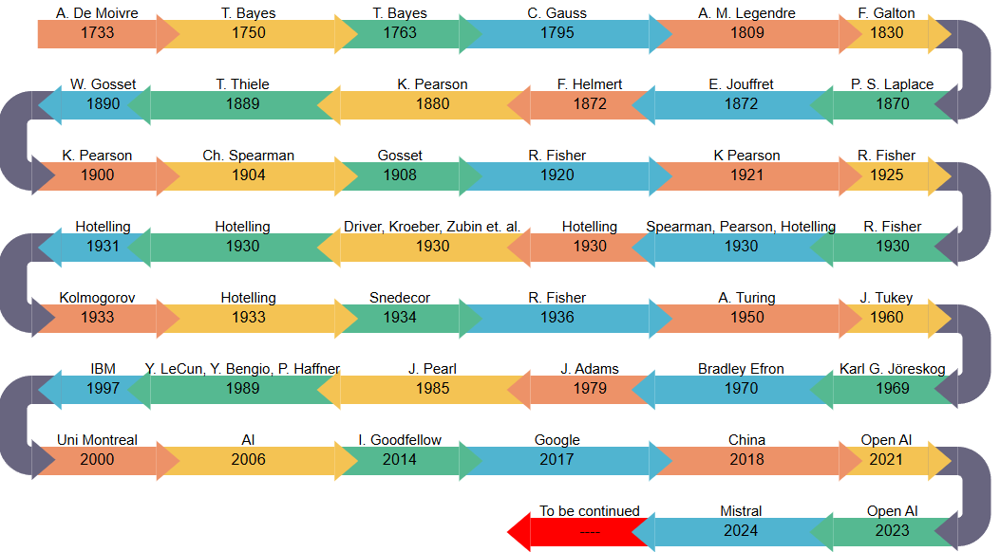

# STATISTICAL TIMELINE 
## From Classical Statistics to Modern AI

**Updated:** June 22, 2025

This project presents an interactive timeline highlighting key milestones in the history of statistics, tracing its evolution from foundational figures like **De Moivre** and **Bayes** to modern developments in **artificial intelligence** and **deep learning**.

The visualization was developed in **RStudio** using the [`r2d3`](https://cran.r-project.org/web/packages/r2d3/index.html) package, which enables the integration of D3.js graphics into R.

### Live demo

The timeline can be viewed at [this RPubs link](https://rpubs.com/hllinas/R_Stat_to_AI_Timeline), which serves as the main visualization. An applied version is also available in [another set of lecture notes](https://rpubs.com/hllinas/R_Multivariado_Historia).

An example of how the timeline looks (without interactivity) is shown in the image below:  




### Project Files

This repository includes all relevant files used to build the timeline:

- `Historia.Rmd` – R Markdown file with the full timeline script
- `Historia.html` – Interactive timeline in HTML format, generated from the R Markdown file
- `script.js` – JavaScript code used in the `r2d3` visualization  
- `DataBase.xlsx` – Excel file containing the historical data  
- `.Rhistory` – R console command history

> When you hover the mouse pointer over the tip of each arrow, a tooltip displays the description of the historical event, as specified in the Excel file.
---

### Project Details

- **Tool:** RStudio  
- **Library:** `r2d3`  
- **Output:** Interactive D3-based timeline  
- **Focus:** Historical development of statistical theory and its connection to modern AI  

### Contributors

- Humberto Llinás (hllinas@uninorte.edu.co)
- Alexander Rangel (alexanderrangel@uninorte.edu.co) 
- Daniela Nuñez (nunezdm@uninorte.edu.co)

### License

This project is intended for educational and academic use. If you use or adapt any part of it, please make sure to cite it appropriately.

### Citation

To cite this repository in your academic work, teaching, or research:

#### APA style

> Llinás, H. (2025). *STATISTICAL TIMELINE: From Classical Statistics to Modern AI* [GitHub repository].
                    GitHub. [https://github.com/usuario/statistical-timeline](https://github.com/hllinas/Stats-to-AI-Timeline/tree/main)

#### BibTeX

```bibtex
@misc{llinas2025timeline,
  author       = {Humberto Llinás},
  title        = {STATISTICAL TIMELINE: From Classical Statistics to Modern AI},
  year         = {2025},
  howpublished = {\url{https://github.com/usuario/statistical-timeline}},
  note         = {GitHub repository}
}
